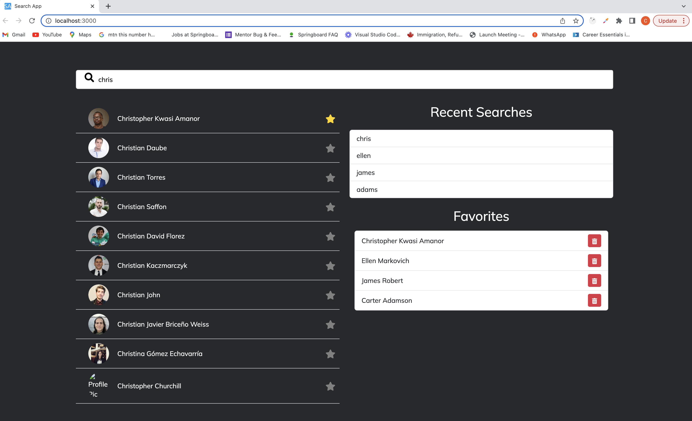

# Search App

This is an application that uses the Torre API endpoints to search for individuals and then displays matching individuals to the search term entered into the app. The app also enables one to see the last 10 most recent searches as well as add and/or remove favorite matching individuals from the search results.

## Requirements

This application was built as part of a technical test with the following requirements:

- Construct a page allowing users to search for names, displaying a list of matching individuals. Take inspiration from **[the torre.ai search](https://torre.ai/search/people-name)**.

- Upon clicking a search result, users should be directed to their genome. This can be either directly on [torre.ai](http://torre.ai/) or through your own implementation.

Additionally, implement **_one or both_** of the following features:

- Display a list showcasing up to 10 of the most recent search queries.
- Provide an option for users to save or favorite individuals and ensure this list is easily accessible.

## Screenshot

## Built With

- React.
- Redux.
- Create React App.
- Twitter Bootstrap.
- [Torre Genome Information endpoint](https://torre.ai/${result.username}).
- [Torre People Search endpoint](https://torre.ai/api/entities/_searchStream).

## Live Video Presentation.

Click [here](https://www.loom.com/share/fe8f776740d0414cada1de31b3496186) to watch a video presentation of the web app.

## Live App

Click [here](https://car-show-guide.netlify.app/) to visit a live version of the web app which has been deployed to Netlify.

## Getting Started

To get a local copy up and running follow these simple example steps.

### Prerequisites

- Node.
- NPM.
- Javascript.
- React.

### Setup

- Clone the repository by running `https://github.com/krys2fa/search-app.git` in your terminal or command line.
- Change directory (i.e. enter `cd search-app` in your terminal) into the project folder.
- Run `npm install` to install dependencies.
- Run `npm start` to start the development server.
- Visit the URL at http://localhost:3000/ to test the application.

### Testing

To run tests,

- Run `npm test` in the project directory in your terminal or command line.

## Author

👤 **Christopher Amanor**

- Github: [@krys2fa](https://github.com/krys2fa)
- Twitter: [@krys2fa](https://twitter.com/krys2fa)
- Linkedin: [Christopher Amanor](https://www.linkedin.com/in/christopher-amanor/)

## 🤝 Contributing

Contributions, issues and feature requests are welcome!

Feel free to check the [issues page](https://github.com/krys2fa/tv-show-guide/issues).

## Show your support

Kindly give this repository a ⭐️ if you like this project!

## Acknowledgments

- Project specifications by [Torre](https://www.torre.ai).

## 📝 License

This project is licensed under the MIT License.
